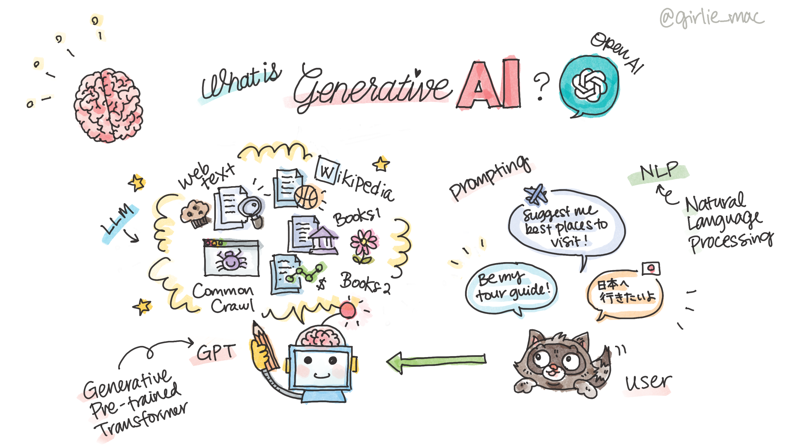

# Generative AI and Prompting 101

In this section, you'll learn the basic concepts about Generative AI, Large Language Models, such as GPT, and prompting.

## What is Generative AI?

Generative AI refers to a type of AI that can create new content by learning from existing data. It's like having a smart assistant that can write essays, create images, or compose music based on the patterns it has learned from large amounts of data. For example, if you give it a topic, it can write an article, or if you describe an image, it can generate that image for you.

## Large Language Models

LLM stands for **Large Language Model**, which is a type of artificial intelligence model that's designed to understand and generate human-like text. LLMs are trained on vast amounts of data, enabling them to perform a wide range of tasks related to natural language processing (NLP) and generation. They are known for their ability to produce coherent and contextually relevant content, translate languages, summarize text, answer questions, and even assist in creative writing or code generation tasks.

Model examples:

- **GPT (Generative Pre-trained Transformer):** This is a series of LLMs that have been trained on diverse datasets to perform a wide range of language-related tasks. They are designed to understand context and generate text that is coherent and contextually relevant.
- **Codex:** While Codex is specialized for understanding and generating code. It has been trained on a mixture of natural language and code from publicly available sources, which allows it to translate natural language prompts into programming code.
- **Dall-E:** It is a modified GPT that generates images from textual descriptions. It uses a version of GPT-3 that's been trained on both text and images, allowing it to create pictures that match the descriptions provided by users.

## Prompting

Prompting is your chat with a language model. It refers to the act of giving an AI system a specific instruction or input that guides it to generate a desired output. A good prompt is clear, specific, and structured in a way that directs the AI towards the intended goal.

For example, if you're working with a language model and you want it to generate a poem, you wouldn't just say "write a poem." That’s too vague. Instead, you might say, "Write a four-line poem about the ocean at sunset." This gives the model a clear structure and topic to work with.

Prompting is crucial because the quality of the output you get from an AI model is often directly related to the quality of the input you give it. Think of it as a sophisticated form of human-computer interaction where the computer understands and generates human language.

## 📺 Watch on YouTube

Watch the video, **Generative AI and prompting 101** on YouTube:

[Subscribe us!](https://www.youtube.com/channel/UCV_6HOhwxYLXAGd-JOqKPoQ?sub_confirmation=1)! 
