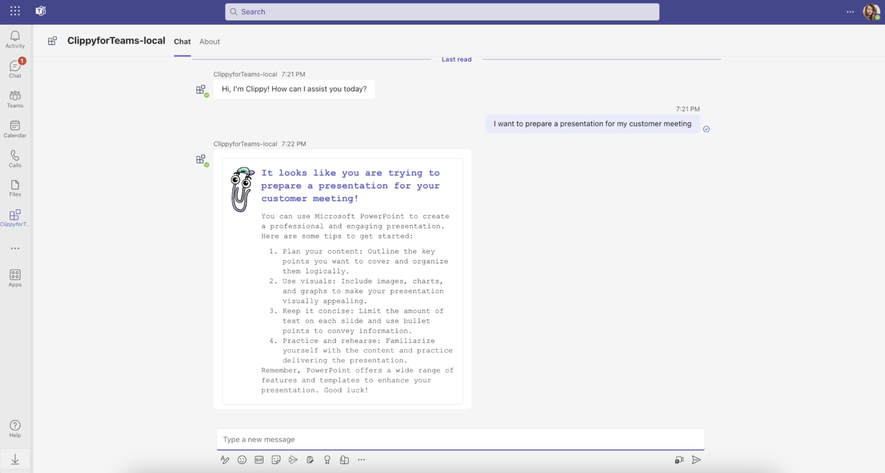

# Overview of the Clippy Chatbot Sample

This app template is built on top of [Teams AI library](https://aka.ms/teams-ai-library).
It showcases a bot app that responds to user questions like Clippy. This enables your users to talk with the AI bot in Teams.

## Get started with the sample

> **Prerequisites**
>
> To run the template in your local dev machine, you will need:
>
> - [Node.js](https://nodejs.org/), supported versions: 16, 18.
> - [Teams Toolkit Visual Studio Code Extension](https://aka.ms/teams-toolkit) latest version or [Teams Toolkit CLI](https://aka.ms/teamsfx-toolkit-cli).
> - Prepare your own [Azure OpenAI](https://aka.ms/oai/access) resource.

1. First, select the Teams Toolkit icon on the left in the VS Code toolbar.
1. Rename, the file `env/.env.local.sample` to `env/.env.local` and `env/.env.local.user.sample` to `env/.env.local.user`. In `env/.env.local.user`, fill in your Azure OpenAI key in `SECRET_AZURE_OPENAI_API_KEY`, endpoint in `AZURE_OPENAI_ENDPOINT`, and deployment name in `AZURE_OPENAI_DEPLOYMENT_NAME`.
1. Press F5 to start debugging which launches your app in Teams using a web browser. Select `Debug in Teams`.
1. You can send any message to get a response from the bot.

**Congratulations**! You are running an application that can now interact with users in Teams:

