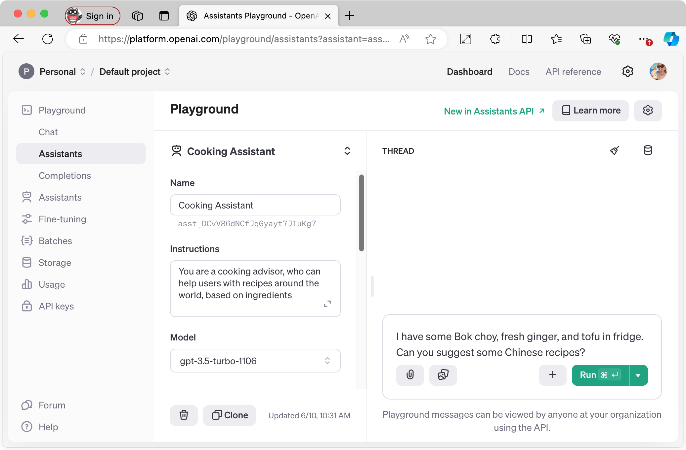

# Build your own cooking assistant with OpenAI Assistants API

In this section, you'll learn about OpenAI's Assistants API and build your own cooking assistant bot that suggests recipes based on what you have in the fridge!

## What is Assistants API?

[OpenAI's **Assistants API**](https://platform.openai.com/docs/assistants/overview) lets you build AI agent-like applications that can understand and generate human-like text, and it is customizable and versatile with your own instructions, model, tools, and files.

> **Note:** The OpenAI Assistants API is a paid service, where developers are billed based on the usage of tokens for the Assistant API at the chosen language model's per-token input/output rates. Please check the latest information on OpenAI's [pricing page](https://openai.com/api/pricing/) for the most up-to-date details!

Assistants API has some main components-

- **Models**: You can choose from a range of GPT-3.5 and GPT-4 models.

And these are the additional tools features that enhance the functionality of the API. They can be either OpenAI-hosted or custom-built by you. The OpenAI-hosted tools include:

- **Code Interpreter**: It allows the API to write & run Python code.
- **File Search (was Retrieval)**: It allows the API to access external knowledge sources from outside its model, such as proprietary product information or documents provided by your users.
- **Function calling**: It refers to custom operations that you can define to perform any task that is not supported by the OpenAI-hosted tools, like, accessing your own databases, APIs, or services. When it invokes functions, the API will pause execution during a Run phase, and you can supply the results of the function callback to continue the Run execution.

The typical integration flow of the Assistants API involves creating an Assistant with custom instructions and a chosen model, adding files, enabling tools, and then creating a Thread to handle the conversation with the user. Messages are added to the Thread as the user interacts with the Assistant, and the Assistant generates responses by calling the model and the tools.

### Example: Cooking Assistant

For example, you can create a cooking assistant. You can give specific instruction to make the chatbot acts as a personal cooking assistant that suggests cuisine recipes based on what's in your fridge.

Let's say, when a user asks a question like, "I have some Bok choy, fresh ginger, and tofu in fridge. Can you suggest some Chinese recipes?", the assistant replies with some yummy recipe suggestions!

To define your assistant, you need to give **instructions** in Assistants API to guide its behavior. In this case, you can provide an instruction like:
*You are a cooking advisor, who can help users with recipes around the world, based on ingredients*.

The API processes your request; When a conversation is started, the API creates a Thread, and creates messages to the Thread, as soon as the user asks questions. This is how it maintains stateful conversations.

Finally, it generates a response; The API runs the Assistant on the Thread to trigger responses to generate a human-like reply message with some dish suggestions.

The user can keep the conversation with the agent in the Thread.

## Use-cases and scenarios

- **Content writer**: You can leverage the API to assist users in drafting emails, articles, blog posts, or social media updates.
- **Personal assistant**: It can help with tasks like scheduling appointments & setting reminders.
- **Travel guide**: It suggests you some interesting places to visit, based on your preferences.
- **Virtual tutor**: such as a math tutor who can walk you through some equations.

These are just a few examples. The possibilities with Assistants API are limited only by your imagination!

You can explore the capabilities of the API with the web-based [Playground on OpenAI's Developer Platform website](https://platform.openai.com/playground?mode=assistant).

It lets you export the configuration to apply on your own applications, including Microsoft Teams apps! Teams Toolkit extension for Visual Studio & VS Code can make your life easier, when want to integrate the API to create your own AI Assistant Bot that lives in Teams!

## 🚀 Build Cooking Assistant bot

**Now let's [build your own Cooking Assistant](sample/README.md)!**

## 📺 Watch on YouTube

Watch the video, **Use OpenAI Assistants API to build your own cooking advisor bot on Teams** on YouTube:

[Subscribe us!](https://www.youtube.com/channel/UCV_6HOhwxYLXAGd-JOqKPoQ?sub_confirmation=1)!
