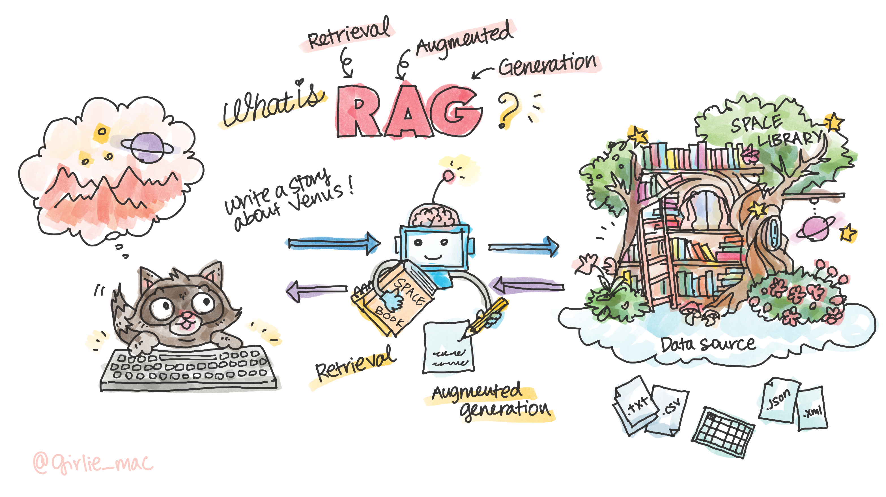

# Intro to Retrieval-Augmented Generation

In this section, you'll learn the concept of Retrieval-Augmented Generation (RAG) and its applications.

## What is RAG?

Retrieval-Augmented Generation, short for RAG, is a way for AI to pull in information from a variety of data sources outside of its training data to give better and more informed responses with the generative models.

- **Retrieval system**: This component searches an external knowledge base to find relevant information.
- **Generative model**: This part of RAG uses the retrieved information to generate responses that are accurate and informative.

The key advantage of RAG is that it allows the generative model to produce responses that are not only based on its training data but also supplemented with up-to-date information from the knowledge base. This results in more accurate, relevant, and contextually appropriate outputs.

Imagine you're writing a science-fiction story about a distant planet, but instead of making it all up, you can ask the chatbot with very specific knowledge about the particular planet, and generate the content that you desire.

Think as the chatbot have the access to a private library that contains books, research papers, and all kinds of information about the universe. It can combine the creativity of Generative AI with the depth of existing knowledge.

So, **Retrieval**, is when you ask about this planet, GenAI goes into this library and pulls out books about planets, stars, and space travel to gather information.

Once the relevant information is retrieved, it synthesizes this information, combining it with its own generative capabilities to craft a story. This is the **Augmented Generation** part.

In reality, when you build a RAG-based app, the data source can be a collection of plain text (such as `.txt`, `.csv` content), or the data come from an API (such as data from `json`, `xml`), or structured database. Or possibly indexed data from a vector search.

## 🚀 Retrieve your custom data

**Now [let's build a custom bot using Azure AI and Teams Toolkit](sample/README.md)!**

## 📺 Watch on YouTube

Watch the video, **Use OpenAI Assistants API to build your own cooking advisor bot on Teams** on YouTube:

[Subscribe us!](https://www.youtube.com/channel/UCV_6HOhwxYLXAGd-JOqKPoQ?sub_confirmation=1)