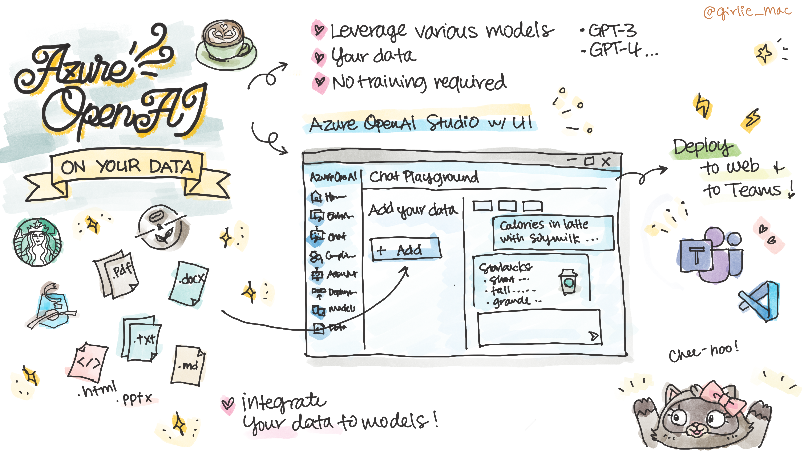

# RAG made it easy with Azure OpenAI On Your Data!

In this section, you'll learn about the practical smart bot development with Azure OpenAI On Your Data.

## What is Azure OpenAI On Your Data?

[**Azure OpenAI On Your Data**](https://learn.microsoft.com/azure/ai-services/openai/concepts/use-your-data) transforms how you interact with your enterprise data, seamlessly integrates and analyzes your data using advanced AI models, such as GPT-35-Turbo and GPT-4, without needing to train or fine-tune models.

You can access Azure OpenAI On Your Data using the web-based interface in the [Azure OpenAI Studio](https://oai.azure.com/), where you can integrate your own data into AI models by simply uploading your datasets.

### Data types

Azure OpenAI On Your Data supports the following file types:
- .txt
- .md
- .html
- .docx
- .pptx
- .pdf

There's an upload limit, and there are some caveats about document structure and how it might affect the quality of responses from the model, so you may need to tweak your data with the [data preparation script](https://github.com/microsoft/sample-app-aoai-chatGPT/tree/main/scripts#data-preparation)!

### Search Types

You can have Azure OpenAI On Your Data to search your data source with the following search types

- [**Keyword search**](https://learn.microsoft.com/azure/search/search-lucene-query-architecture)
- [**Semantic search**](https://learn.microsoft.com/azure/search/semantic-search-overview)
- [**Vector search**](https://learn.microsoft.com/en-us/azure/search/vector-search-overview) using Ada [embedding](https://learn.microsoft.com/azure/ai-services/openai/concepts/understand-embeddings) models (available in [selected regions](https://learn.microsoft.com/azure/ai-services/openai/concepts/models#embeddings-models))

### Deploy to Teams

One of the standout features is the **Deploy to Teams** option. With just a few clicks, you can deploy your AI models directly into Microsoft Teams, enhancing your collaboration and productivity.

So, whether you're looking to personalize your AI models with your own data or bring AI capabilities directly into your Teams workspace, Azure OpenAI Studio has got you covered 💪

## 🚀 Try by yourself

**Now [let's build a custom bot using your data on Azure OpenAI Studio](sample/README.md)!**

## 📺 Watch on YouTube

Watch the video, **Bring Your AI App to Teams with Azure OpenAI Studio's New 'Deploy to a Teams App' Feature** on YouTube:

[Subscribe us!](https://www.youtube.com/channel/UCV_6HOhwxYLXAGd-JOqKPoQ?sub_confirmation=1)