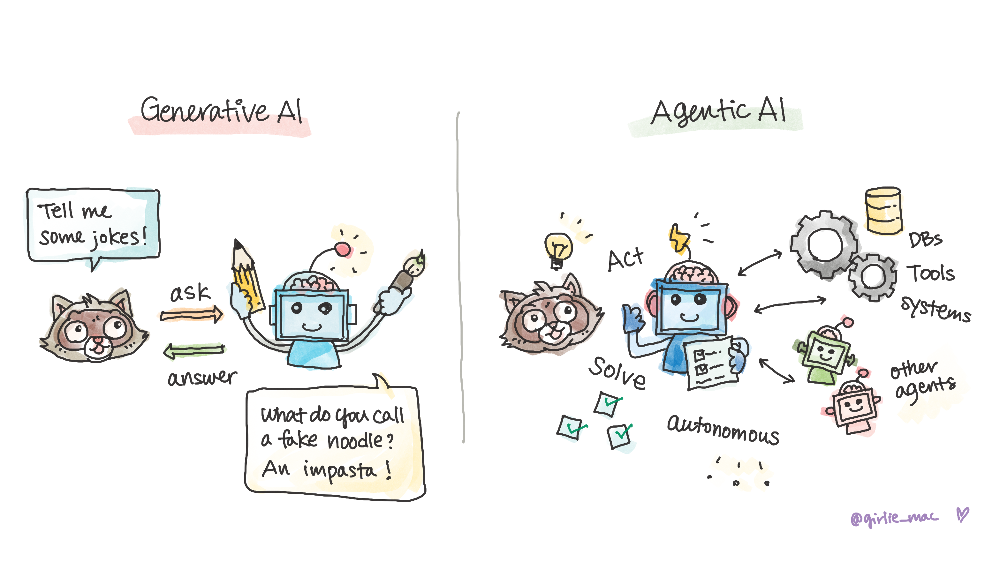
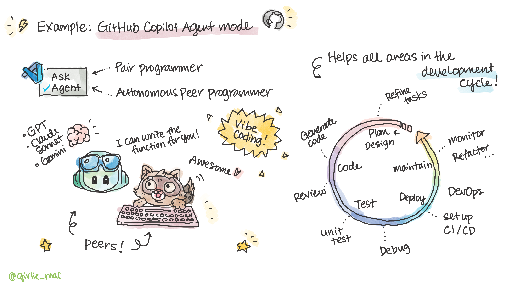
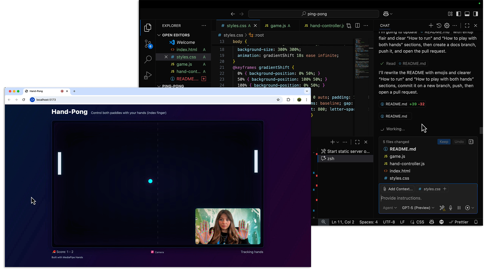

# What is Agentic AI? 

*From autocomplete to autonomy, GitHub Copilot is now agentic! Explore **GitHub Copilot Agent Mode** and see what agentic AI can do*

## Intro Agentic AI

In the early days of Generative AI, most systems were **chat-based assistants**. They amazed us with their ability to answer questions, generate text, or create content.  

But in **late 2024 and into 2025**, the focus began shifting toward **Agentic AI**.  

Agentic AI doesn’t just answer questions—it can:  
- **Act independently** to achieve goals  
- **Make decisions** in real-world workflows  
- **Invoke tools and perform multistep tasks** without constant human supervision  

Think of it as moving from **a smart assistan** → to **a problem-solving teammate.**  

### Agentic AI vs AI Agents

Let's not confuse these terms, although sometimes they are used almost interchangeably. 

**Agentic AI** is a broad concept describing AI *systems* that can act autonomously with goals, decision-making, and the ability to affect their environment, often emphasizing human-like initiative and responsibility.

**AI agents**, on the other hand, are the practical implementations of this idea—software *entities* designed to perceive inputs, reason, and take actions within a specific environment (like a trading bot, customer support assistant, or game character).

In short: Agentic AI is the capability; AI agents are the concrete instances that use it!

## GitHub Copilot Agent Mode  

A great example of Agentic AI in action is **GitHub Copilot Agent Mode**.  

When you turn it on, Copilot stops being just a pair programmer—it becomes an **autonomous peer programmer**.  

### ✨ What it can do
- **Vibe coding** → Describe what you want (*“Build a browser based ping pong game that I can control with my hand gesture”*), and Copilot sets up the scaffolding, UI, and code in one go. 
- **Context-aware coding** → Analyzes your entire project and decides which files matter.  
- **Code reviews** → Flags bugs and performance issues before human reviewers.  
- **Fixing and testing** → Writes unit tests, fixes compiler errors, and iterates until the task is complete.  
- **Terminal & workflows** → Runs commands and integrates with CI/CD pipelines directly.  

All of this happens in a **plan–act loop**, where Copilot takes steps toward your goal, checks results, and adjusts—while keeping developers in the loop for safety.  

## Why it matters  

Agentic AI represents the next big shift in how we build software:  
- **Less manual overhead** in setup and debugging  
- **Smarter workflows** with integrated tools  
- **Faster iteration** without losing human oversight  

We’re moving toward a future where AI isn’t just helping us write code—it’s becoming an **active collaborator in the development lifecycle**.  

---

## 🚀 Explore GitHub Copilot Agent Mode 

**Now [let's vibe-code to build a game!](sample/README.md)!**

## 📺 Watch on YouTube

Watch the video, **Intro Agentic AI and Vibe code with GitHub Copilot Agent Mode** on YouTube:

[Subscribe us!](https://www.youtube.com/channel/UCV_6HOhwxYLXAGd-JOqKPoQ?sub_confirmation=1)

# 🤿 Dive Deeper!

Once you are familiar with the basics, go deep-dive into the world of agentic AI and building agents!

## Building Agents

[**AI Agents for Beginners**](https://github.com/microsoft/ai-agents-for-beginners) is a multi-lingual course teaching everything you need to know to start building AI Agents!

The course includes:
- Agentic frameworks 
- Design pattern
- Security

and more!

## Building Microsoft 365 Agents

If you are interested in building enterprise grade AI agents for M365 platform, [**Copilot Developer Camp**](https://microsoft.github.io/copilot-camp/) is for you to learn various types of agents and how to build them!