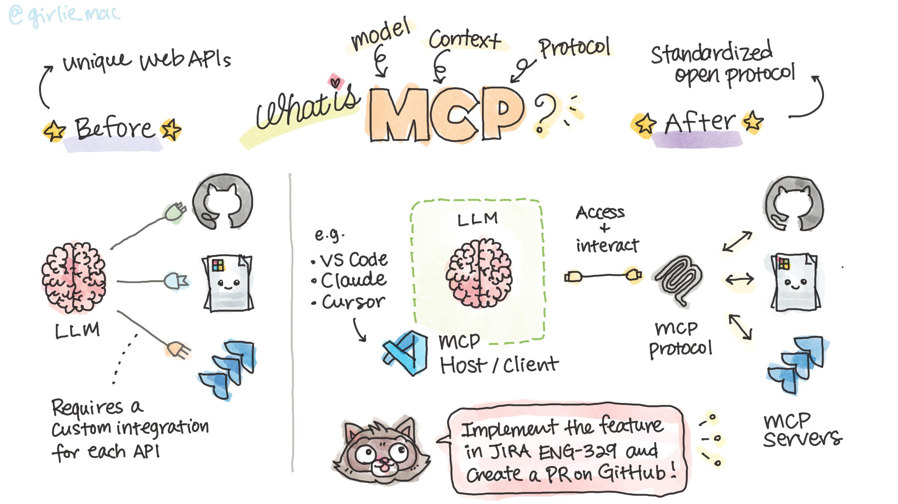
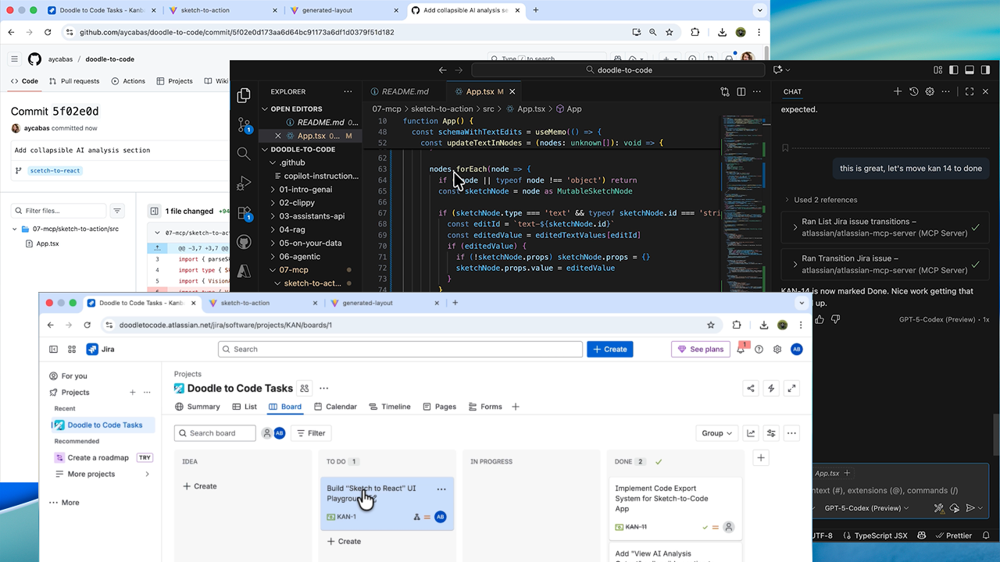

# MCP (Model Context Protocol)

*Let MCP Handle Your Development Workflows*

## 🧩 What Is MCP (Model Context Protocol)?

If you’ve ever wished your AI assistant could *actually* do things — like check your calendar, pull data from Notion, analyze a spreadsheet... Or for developers, hecking a GitHub repo, creating a Jira ticket, or pulling live documentation — that’s what **MCP** is made for.

**MCP** stands for **Model Context Protocol** — an open standard that defines how AI models can securely connect and interact with other tools, apps, and data sources.

Whether it’s a productivity app, a knowledge base, or your favorite developer platform, MCP provides a common way for AI systems to access real information and take action — instead of working in isolation.

## 🚀 Why MCP Matters

Large Language Models (LLMs) are powerful, but they have one big limitation:  
they only know what’s inside their training data.

When you ask for something outside that scope — say, _“What’s the status of my PR?”_ — the model can’t access live info. It might even **hallucinate**.

**MCP solves this problem** by letting LLMs fetch **real data from trusted sources**, so they can stay accurate and context-aware.

## ⚙️ Before MCP: A Messy World of Custom Integrations

Before MCP, every tool needed a **custom integration** to talk to an LLM:

- GitHub? Build one adapter.  
- Jira? Another one.  
- Microsoft Learn docs? Yep — another.

It was like needing a different charger 🔌 for every device.  
Developers had to maintain multiple model-specific connectors — messy, redundant, and hard to scale.

## 🔌 MCP: The USB-C of AI

MCP changes all that.  
Think of it as **USB-C for AI models and tools** — one universal connector that lets models communicate with any compatible service.

Open-sourced by **[Anthropic](https://www.anthropic.com/)**, MCP defines a **standardized protocol for communication between AI models and external tools** — such as GitHub, Jira, Notion, Figma, or even your own internal applications.

Under the hood, MCP uses **JSON-RPC** over channels like **stdio** or **websockets** to exchange structured messages between a **Host** (where the model runs) and one or more **MCP Servers** (which expose capabilities and data sources).  

Each server describes its available functions, resources, and prompts in a consistent schema, so the model can discover, query, and invoke them dynamically — without custom integration code.

This standardization means any model that supports MCP can interact with any MCP-compliant server — no more one-off connectors or brittle API glue.

## 🧠 How MCP Works

MCP defines a few key components to make this connection happen:

### 🏠 MCP Host

The **Host** is the environment where the language model runs.  
Examples include:

- AI-enhanced IDEs like **VS Code**, **Claude Desktop**, or **Cursor**
- Other AI-powered tools that embed model capabilities

Inside the Host is a **Client** component — it handles the communication with external MCP servers, managing authentication, messaging, and connection lifecycle.

### 🌐 MCP Servers

The **Servers** are what bridge the model to your data or services.  
Each one exposes a set of resources or actions that the model can access:

- **GitHub MCP Server** → repositories, pull requests, commits  
- **Microsoft Learn MCP Server** → technical docs and tutorials  
- **Atlassian MCP Server** → Jira issues, Confluence pages  
- **Custom MCP Server** → your internal APIs or local data sources

A Host can connect to multiple MCP servers, giving your model access to everything it needs in your dev ecosystem.

---

## 🔁 Why MCP ≠ Just Another API

This isn’t your typical one-way API call.

While traditional APIs fetch data before generating a response (think RAG pipelines), MCP is **two-way and stateful**.  
That means the model can:

- Interact with tools in real time  
- Maintain context across multiple steps  
- Make dynamic decisions as it goes

So instead of just *getting data*, the model can actually *do things*, like:

> “Implement the feature in this Jira ticket" then "create a PR in GitHub.”

That’s the difference between an **AI assistant** and an **AI agent** — MCP makes the latter possible.

---

## 🌍 The Future of Connected AI

MCP is still evolving, but it’s already being adopted across developer tools.  
By giving LLMs a reliable, standardized way to interact with real-world systems, MCP brings us closer to truly **agentic AI** — models that don’t just generate answers, but take meaningful action inside your workflow.

In short:  
**MCP bridges the gap between AI and your dev tools — securely, consistently, and at scale.**

---
---

## 🚀 Let MCP Handle Your Development Workflows!

**Now [let's learn how you can leverage these MCP servers](sample/README.md)!**

## 📺 Watch on YouTube

Watch the video, **MCP (Model Context Protocol) - Let MCP Handle Your Development Workflows** on YouTube:

[Subscribe us!](https://www.youtube.com/channel/UCV_6HOhwxYLXAGd-JOqKPoQ?sub_confirmation=1)

# 🤿 Dive Deeper!

Once you are familiar with the basics, go deep-dive into the world of agentic AI and MCP!

## Building Agents

[**MCP for Beginners**](https://github.com/microsoft/mcp-for-beginners) is a multi-lingual course teaching everything you need to know to start building AI applications that communicate with different tools and services.

## Building Microsoft 365 Agents

If you are interested in building enterprise grade AI agents for M365 platform, [**Copilot Developer Camp**](https://microsoft.github.io/copilot-camp/) is for you to learn various types of agents and how to build them!