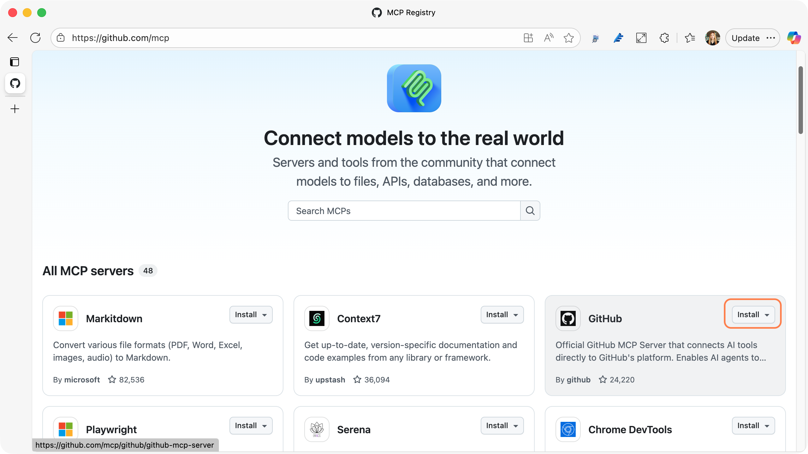
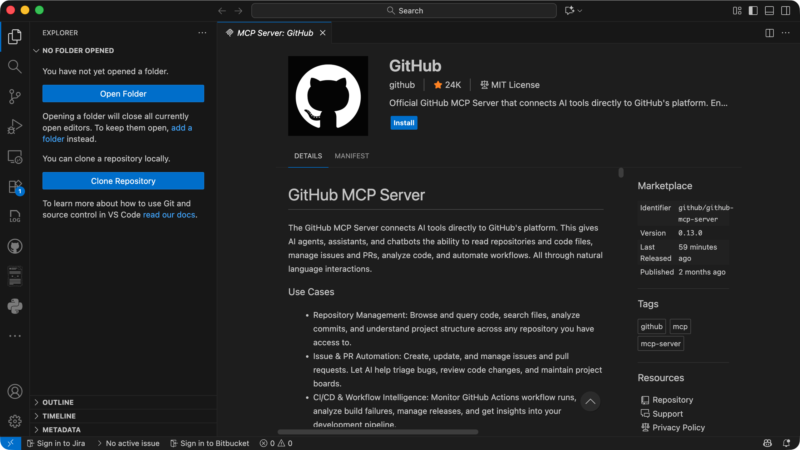
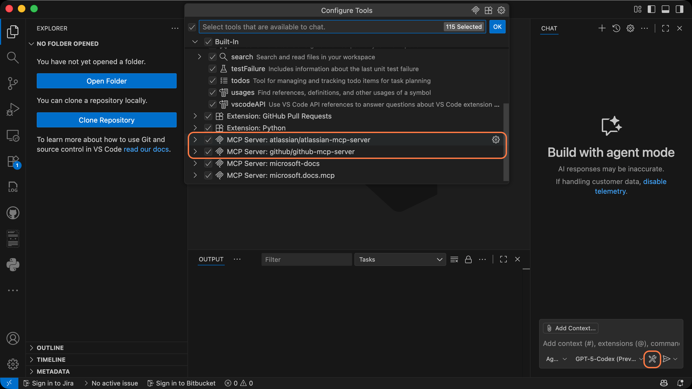

# 🧠 Let MCP Handle Your Development Workflows

Tired of context-switching between Jira, GitHub, and your editor?  
With MCP, your AI coding assistant can do that for you — safely and intelligently.

MCP isn’t just about fetching data; it enables **two-way, stateful communication** between AI models and developer tools. That means your model can understand a task from Jira, open the related repository in GitHub, create or update files, and even generate a pull request — all through the same standardized protocol.

In this guide, we’ll walk through how MCP simplifies your daily dev workflow using:

- **GitHub MCP Server** — to browse repositories, open pull requests, and review code.  
- **Atlassian Remote MCP Server** — to track and update Jira tickets directly from your AI workspace.

Together, these integrations let you work in natural language:  
> “Implement the feature in this Jira ticket" 

> "Create a PR in GitHub.”

Let’s see how that actually works in practice.

## Installing MCP Servers

**GitHub MCP Server**
- Go to [GitHub MCP Registry](https://github.com/mcp), look for **GitHub** MCP server and install to VS Code (or VS Code Insider, if you are using one!)
- You will be ask to authenticate when installing the MCP servers. Log in to GitHub and authenticate it.

  
  

**Atlassian MCP Server**
- Go back to [GitHub MCP Registry](https://github.com/mcp), and install **Atlassian** MCP servers in the same manner.
- Log in to your Jira account and authenticate it as well.

## Enabling the MCP servers in VS Code

- Make sure the MCP servers are available by opening GitHub Copilot and click on the tools icon.

  

## Ask GitHub Copilot agent to work with Jira tickets

To get all assiened tickets, try prompting:
```
What are open tasks assigned to me in Jira?
```

You can also ask the agent to summarize the comleted tasks, ask about a certain ticket, and have Copilot to vibe-code to implement that the ticket describes. 


Ask about a ticket:
```
Explain the ticket, KAN-14
```
Have Copilot to implement the feature that was stated in the ticket:
```
Implement the feature described in the ticket
```

Then if all looks good, you can close the task:

```
Move KAN-14 to Done
```

## Ask GitHub Copilot agent to puch to GitHub

Now you use GitHub MCP server to commit and push the changes to the project repo.

```
Commit the changes and push to the branch
```

It will run the commands.

You can also view the changes on GitHub:
```
What is the branch link?
```