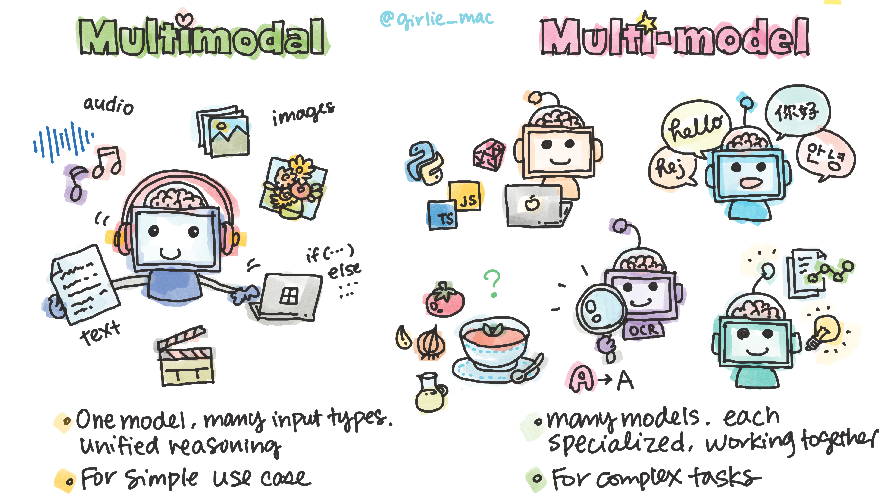

# 🧠 Multimodal and Multimodel in AI

Let's learn about two concepts you'll hear a lot in modern AI — **multimodal** and **multi-model**.
They sound almost the same, but they work in very different ways.

## 🧿 What Is Multimodality?

**Multimodality** means an AI model can understand and generate *multiple types of data* and combine them to reason about the world.

A **multimodal model** is a *single AI model* that works across:

- 📝 Text  
- 🖼️ Images  
- 🔊 Audio  
- 🎥 Video  
- 💻 Code  
etc.

Think of it as **one brain with multiple senses** — all working together.  
The model can read an image, interpret the text inside it, listen to accompanying audio, and respond in natural language, all in one flow.

### When multimodal model approaches shine
- Simple, end-to-end tasks  
- Scenarios where reasoning across multiple data types matters  
- Apps where you want **one model** and minimal engineering overhead  
- Fast prototyping or lightweight workflows

## 👯 What Is the Multi-model Approach?

A **multimodel** system uses **multiple specialized AI models**, each designed for a specific task.

Examples:
- 👁️ A vision model for image understanding  
- 🌐 A translation model for languages  
- 💬 A large language model for reasoning  
- 🧩 A classifier or embedding model for structured tasks  

Your application becomes the **orchestrator**, passing outputs from one model to another as a workflow.

This is like having a **team of experts**, each doing what they're best at.

### When multi-model systems shine
- High-accuracy, domain-specific requirements  
- Workflows that need fine control at each step  
- Combining best-in-class models for each modality  
- Large-scale pipelines where cost efficiency matters  

## ⚖️ Which Approach Should You Choose?

**Multimodal**  
- ✔ Fewer moving parts  
- ✔ Easy to build with  
- ✔ Great for general use  
- ❌ Can be more expensive per inference  
- ❌ Not always the best for specialized tasks  

**Multimodel**  
- ✔ Higher accuracy through specialization  
- ✔ More cost-efficient at scale  
- ✔ Fine-grained control  
- ❌ Requires more engineering  
- ❌ More points of failure  

## 🧜‍♀️ Hybrid Approaches (Often the Sweet Spot)

In many real applications, you'll mix both:

- Use **specialized models** for tasks like OCR or transcription  
- Use a **multimodal model** or LLM on top to reason and produce a final answer  

This gives you a balance of accuracy, cost efficiency, and flexibility.

## 🧪 Example in the video: Multi-model Approach

**Scenario:**
You're traveling in Japan, sitting at a restaurant for lunch.
You take a photo of the menu and ask your app:

> "Can you suggest gluten-free meals from this menu?"

**How the app handles it:**

The app orchestrates three specialized models, each doing what it's best at:

1. **OCR Model** extracts the text from the menu image — including Japanese characters, prices, dish names, and descriptions.
1. **Translation Model** translates the extracted text into English (or the user's preferred language) with high linguistic accuracy.
1. **LLM for Reasoning** analyzes the translated menu, identifies ingredients, checks for gluten-containing items, and returns a clear recommendation of safe dishes.

---

## 🚀 Try the Example App

**Now [Try the Example App by Yourself](sample/README.md)!**

## 📺 Watch on YouTube - Will be available soon!

Watch the video, **Multimodal and Multi-model AI** on YouTube:

[Subscribe us!](https://www.youtube.com/channel/UCV_6HOhwxYLXAGd-JOqKPoQ?sub_confirmation=1)