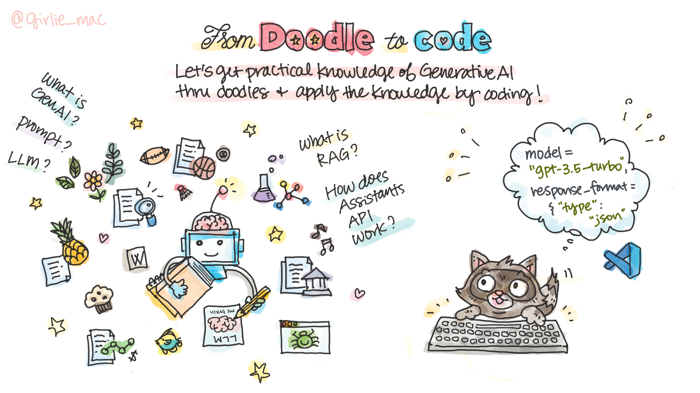

# Doodle to Code: A Practical guide to getting started with Generative AI

Learn the fundamentals of Generative AI and related technologies from doodles and apply the knowledge by coding. Each content comes with a video, conceptual doodles, and hands-on projects to build a practical app with conversational AI. Optimize your knowledge and enhance your skills!

## 🌱 Prerequisites

For coding exercises, it is recommended to use [Visual Studio Code](https://code.visualstudio.com/) for the best experience. 

## Topics

| # | Topics       | Descriptions |
|---|--------------|--------------|
| 01 | [Generative AI and Prompting 101](01-intro-genai/README.md)  | Explore the basic concepts of Large Language Model (LLM) such as GPT, and prompt engineering. Also learn how to use Azure OpenAI services. |
| 02 | [Personalize AI chatbot using prompts](02-clippy/README.md) | Master the art of prompt engineering to build Clippy for Teams using Azure OpenAI and Teams AI Library. |
| 03 | [OpenAI Assistants API](03-assistants-api/README.md) | Learn OpenAI Assistants API and build your own cooking advisor bot on Teams. |
| 04 | [Intro to Retrieval-Augmented Generation (RAG)](04-rag/README.md)  | Import your custom data using Azure AI Search and build a RAG-based AI assistant in Python using Teams Toolkit. |
| 05 | TBD | Coming soon! |
